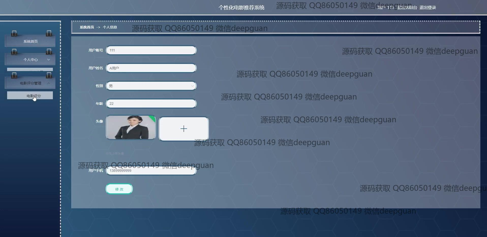
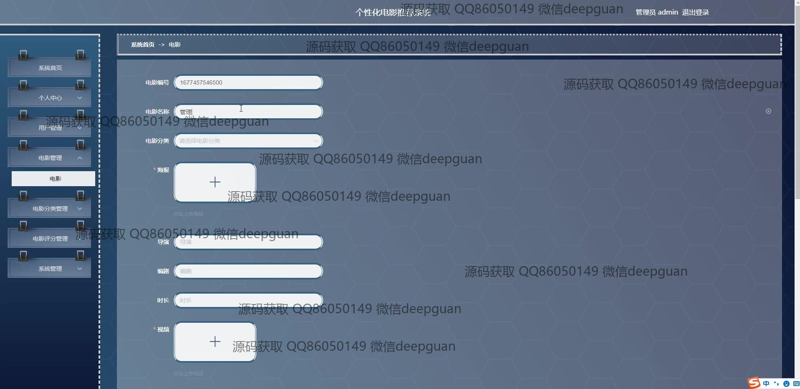
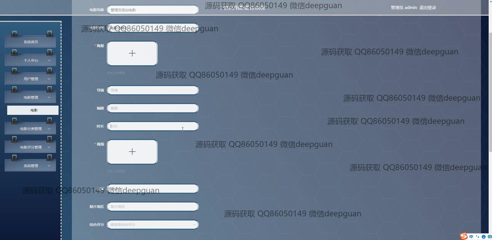
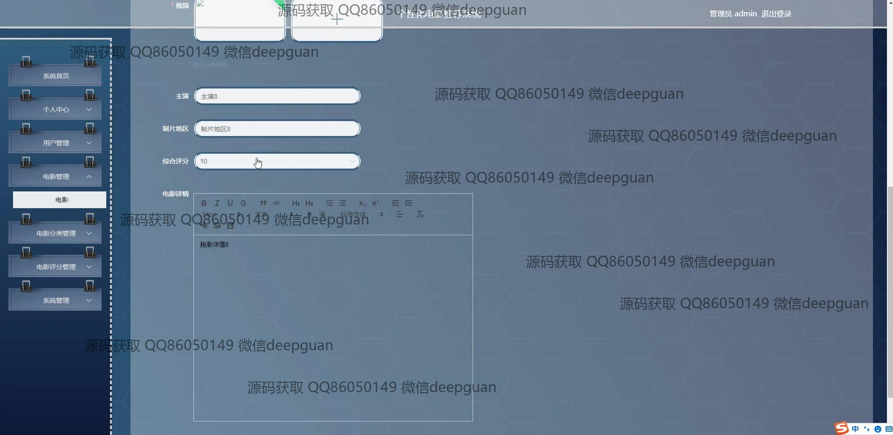
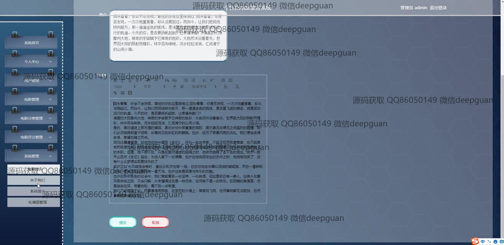

<h1 align="center">个性化电影推荐系统</h1>

## 简介
个性化电影推荐系统：角色分为管理员、用户；主要功能包括用户注册、登录、电影浏览、个性化推荐、用户评分与评论、后台管理和影片信息输入管理，旨在提升用户观影体验和平台粘性。    --计算机毕业设计源码；毕设源码；java毕业设计源码

## 联系方式

<h3 align="center">获取完整代码与数据库文件 + 微信：deepguan QQ: 86050149 QQ群: 783742310</h3>

<h3 align="center">可帮忙远程部署 包运行成功！提供远程部署、修改代码、设计文档指导、代码讲解等服务！</h3>

## 功能介绍（完整见运行截图）
用户：提供注册和登录功能，浏览电影和个性化推荐列表。用户可通过输入个人喜好与评分，接收系统生成的电影推荐。此外，用户可以查看电影详情、评分和评论，并利用搜索功能查找感兴趣的电影，以提升互动性和趣味性。

管理员：管理界面提供包括系统首页、个人中心、用户管理、电影管理、电影分类管理等功能模块。管理员可录入和更新电影信息，支持上传电影海报和视频，管理详细信息如名称、分类、导演、编剧和评分，确保推荐系统的数据资源丰富和准确。

系统：通过分析用户观看历史和偏好，提供个性化的电影推荐，并通过简洁的界面设计提升用户体验。系统包含导航栏、轮播图和搜索功能，便于用户浏览、选择和获取电影信息。后台支持用户信息管理、电影分类管理、评分管理及文本编辑功能。

个人中心：提供用户详细信息管理功能，包括修改用户账号、姓名、性别、年龄、头像和联系电话。支持个人数据更新，有利于用户自主营销和信息内容管理，增强用户和平台的粘性。

## 运行截图

本代码来源于网络,仅供学习参考使用!

